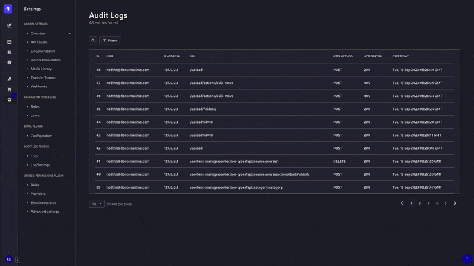
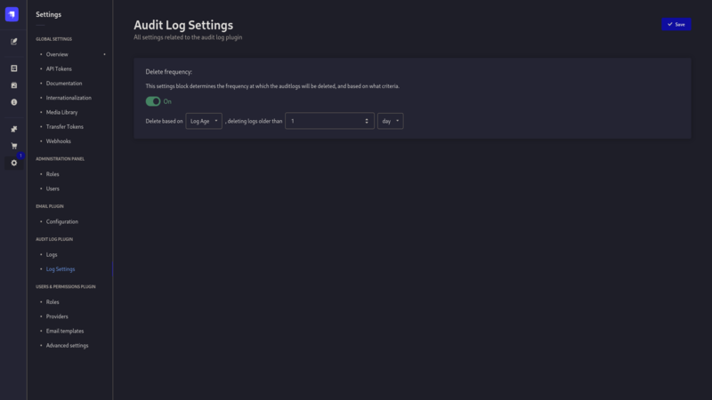

# Audit Log Plugin

## Description

This plugin aims to store all user interactions as logs that can be accessed easily and securely through the use of permissions. 




## Configuration:

The default configuration is as follows (you must add it to `./config/plugin.js`):

```js
module.exports = {
    // ...
    "@marje3psut/strapi-plugin-audit-log": {
        enabled: true,
        config: {
            filters: {
              endpoint: {
                exclude: ["/content-manager/uid", "/admin/renew-token"],
              },
              status: {},
              method: {
                exclude: ["GET"],
              },
            },
            redactedValues: [
              "password",
              "token",
              "firstname",
              "lastname",
              "username",
            ],
          }
    }
    // ...
}
```

Each of the filter properties can either have an exclude or an include property, but not both. The redactedValues proterty will specify the set of properties to redact in the request body and response body in the logs.

## Links:

- [TODO](./docs/TODO.md)
- [BREAKDOWN](./docs/BREAKDOWN.md)